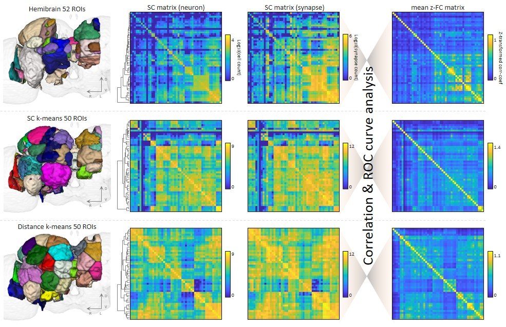
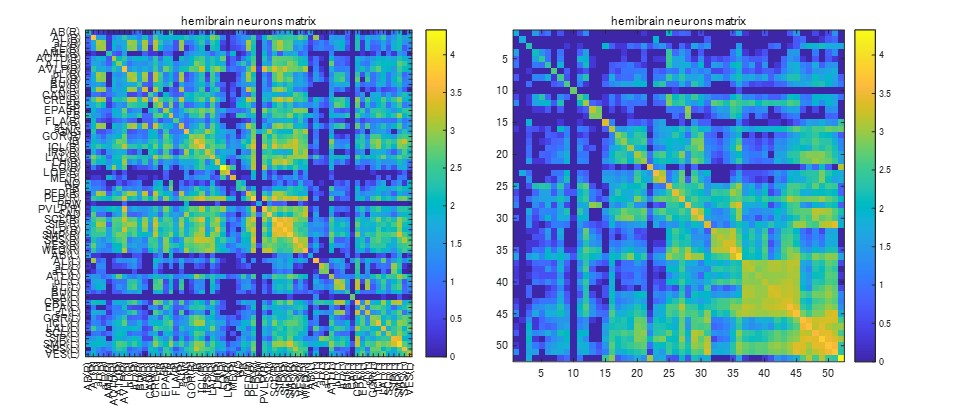
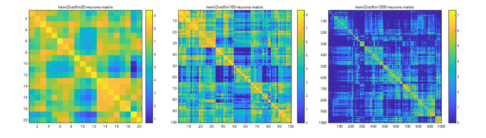
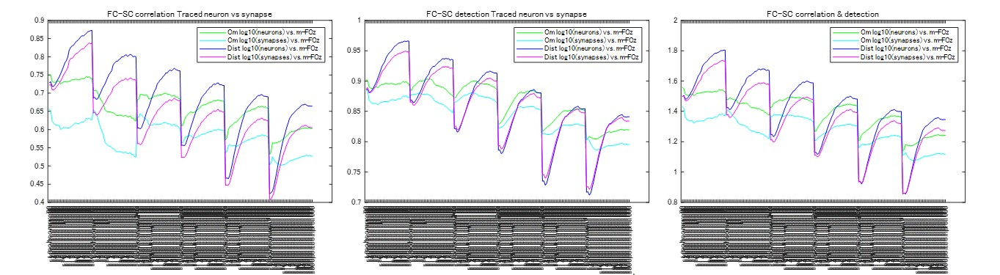
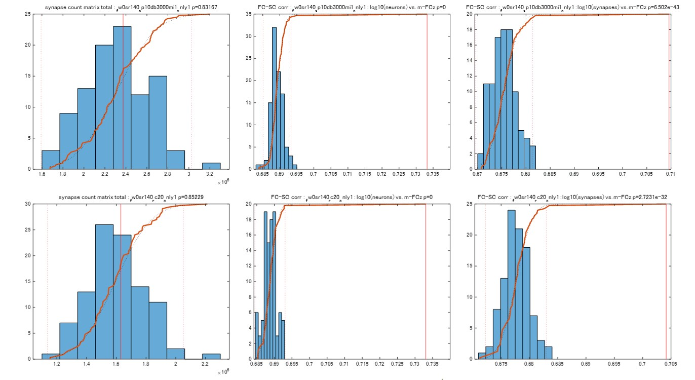
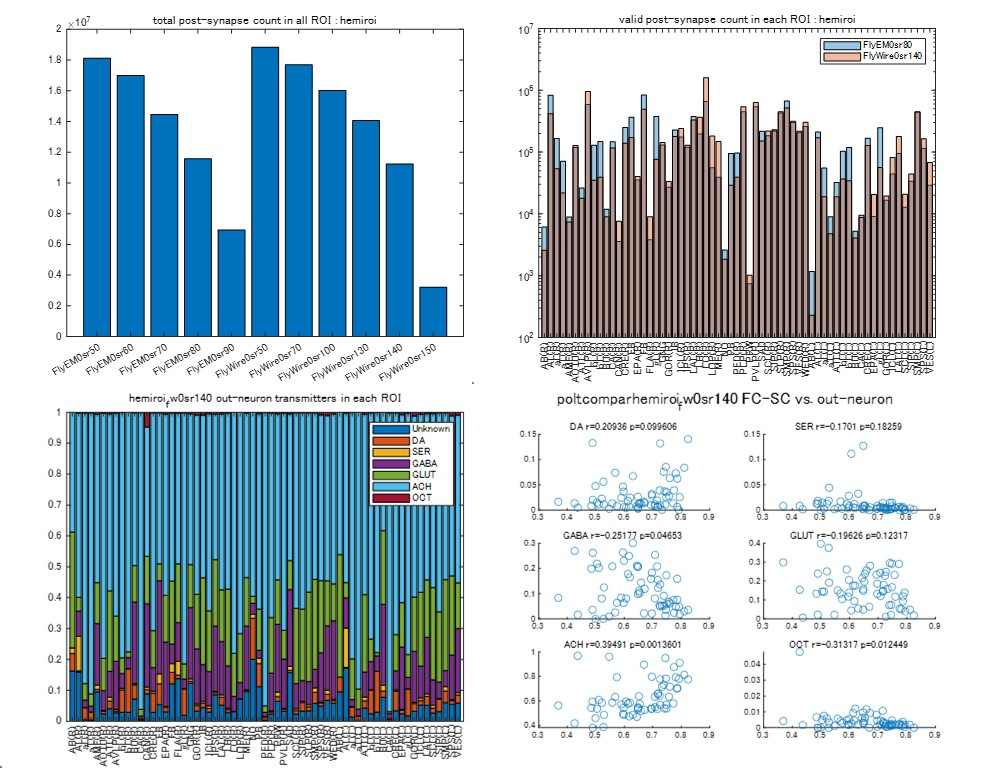

# flywalk
Code for a manuscipt of the flywalk. 
Takuto Okuno, Alexander Woodward, Hideyuki Okano, Junichi Hata (in submisstion)
["Functional connectivity, structural connectivity, and inter-individual variability in Drosophila melanogaster"](https://www.yahoo.com/)

## Requirements: Software
* MATLAB R2021b or later
* Parallel Computing Toolbox ver7.1 or later

## Installation
1. Download this code zip file.
2. Extract zip file under your working directory <work_path>.
3. Run the MATLAB software, and "Add Path" extracted directories (i.e. <work_path>/flywalk-main).
4. Move to <work_path>/flywalk-main directory and run the following demos.

## Demo Codes
<b>Demo 1</b> 
The first demo shows the structural connectivity (SC) of hemibrain primary 63, 52 ROIs, CmKm and DistKm ROIs in Drosophila melanogaster (Fig.1a, Fig.2a). 
Pre-processed connect list files should be downloaded from [zenodo](https://doi.org/10.5281/zenodo.7827225) and extracted under <work_path>/flywalk-main directory before running this code. 
(Please confirm to update data and results directory.)

~~~
>> makeStructConnectivity
...
~~~

This demo shows several SC matrices of hemibrain, CmKm and DistKm ROIs. 

 
<b>Demo 2</b> 
Second demo shows relation between spatial smoothing and FC-SC detection & correlation in DistKm and CmKm ROIs (Fig.2b). 
Additionally, random synapse extraction test (permutation test) results are also shown (Fig.4e,f,i). 

~~~
>> plotFuncConnectivity
...
~~~

From left to right, FC-SC correlation, FC-SC detection and FC-SC detection & correlation score, respectively. The vertical axis shows the correlation coefficient, averaged AUC and FC-SC detection & correlation score, respectively. The horizontal axis shows smoothing size 0 to 300 with Polynomial & tCompCor methods and ROI size. 

 

(Top) Histogram of null SC matrices (blue bar) and extracted SC matrix with PPSSI (0-0.1) (red slid line). Black dot line shows cumulative distribution function of the normal distribution, brown slid line shows cumulative distribution function of null & extracted SC matrices, and red dot line shows Bonferroni-corrected p<0.05 threshold. Left shows SC matrix (synapse) total, center shows FC-SC correlation (neuron), and right shows FC-SC correlation (synapse). 
(Bottom) Histogram of null SC matrices and extracted SC matrix with reciprocal-synapse (≤2μm). 

 
<b>Demo 3</b> 
Third demo shows comparison between FlyEM (cf0.8) and FlyWire (sc140) post-synapses (Fig.3a,c).
This also shows out-neuron, in-neuron neurotransmitters in hemibrain primary 63 ROIs using FlyWire (sc140) (Fig.3f,g). 

~~~
>> plotStructConnectivity
poltcomparhemiroi_fw0sr140 FC-SC vs. out-neuron DA r=0.20936 p=0.099606
poltcomparhemiroi_fw0sr140 FC-SC vs. out-neuron SER r=-0.1701 p=0.18259
poltcomparhemiroi_fw0sr140 FC-SC vs. out-neuron GABA r=-0.25177 p=0.04653
...
~~~

(Top left) Bar graph of post-synapse count in hemibrain region from FlyEM and FlyWire connectome data. The vertical axis shows post-synapse count, and the horizontal axis shows confidence thresholds for FlyEM and Cleft score thresholds for FlyWire. (right) Bar graph of post-synapse count in hemibrain primary ROIs. Blue bar shows FlyEM (cf0.8), red bar shows FlyWire (sc140). The vertical axis shows post-synapse count, and the horizontal axis shows hemibrain primary ROIs. 
(Bottom left) Bar graph of neurotransmitter rate of output neurons in hemibrain primary ROIs based on FlyWire (sc140) connectome data. The horizontal axis shows hemibrain primary ROIs. (DA: dopamine, SER: serotonin, GABA, GLUT: glutamine, ACH: acetylcholine, OCT: octopamine). (right) Scatter plots of neurotransmitter rate of output neurons vs. FC-SC correlation (neuron) in hemibrain primary ROIs (FlyWire sc140). Each of the six neurotransmitters was compared. 
