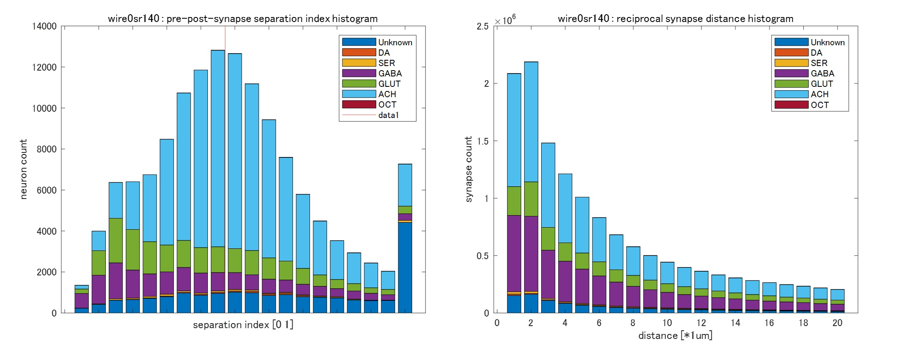

# Fly FC-SC analysis scripts
Scripts for a manuscipt of ["Functional connectivity, structural connectivity, and inter-individual variability in Drosophila melanogaster,"](https://www.yahoo.com/)
Takuto Okuno, Alexander Woodward, Hideyuki Okano, Junichi Hata (in submisstion)

## Requirements: Software
* MATLAB R2021b or later
* Parallel Computing Toolbox ver7.1 or later

## Installation
1. Download this code zip file.
2. Extract zip file under your working directory <work_path>.
3. Run the MATLAB software, and "Add Path" extracted directories (i.e. <work_path>/flywalk-main).
4. Move to <work_path>/flywalk-main directory and run the following demos.

## Demo Codes
<b>Demo 1</b> 

The first demo shows the structural connectivity (SC) of hemibrain primary 63, 52 ROIs, CmKm and DistKm ROIs in Drosophila melanogaster (Fig.1a, Fig.2a).
Pre-processed connect list and other files should be downloaded from [zenodo](https://tmpuc.box.com/s/2xmocqmj8hjd5tuqrei9gpnzwqm7mdqi), and extracted a zip file to overwrite 'data' and 'results' directories in <work_path>/flywalk-main before running this code. 
(Please confirm to update data, results and swc directories.)

~~~
>> makeStructConnectivity
...
~~~

This demo shows several SC matrices of hemibrain, CmKm and DistKm ROIs. 

<b>Demo 2</b> 

Second demo shows relation between spatial smoothing and FC-SC detection & correlation in DistKm and CmKm ROIs (Fig.2b). 
Additionally, random synapse extraction test (permutation test) results are also shown (Fig.4e,f,i).

~~~
>> plotFuncConnectivity
...
~~~

From left to right, FC-SC correlation, FC-SC detection and FC-SC detection & correlation score, respectively. The vertical axis shows the correlation coefficient, averaged AUC and FC-SC detection & correlation score, respectively. The horizontal axis shows smoothing size 0 to 300 with Polynomial & tCompCor methods and ROI size. 

 

(Top) Histogram of null SC matrices (blue bar) and extracted SC matrix with PPSSI (0-0.1) (red solid line). Black dot line shows cumulative distribution function of the normal distribution, brown slid line shows cumulative distribution function of null & extracted SC matrices, and red dot line shows Bonferroni-corrected p<0.05 threshold. Left shows SC matrix (synapse) total, center shows FC-SC correlation (neuron), and right shows FC-SC correlation (synapse). 
(Bottom) Histogram of null SC matrices and extracted SC matrix with reciprocal-synapse (≤2μm). 

<b>Demo 3</b> 

Third demo shows comparison between FlyEM (cf0.8) and FlyWire (sc140) post-synapses (Fig.3a,c).
This also shows out-neuron, in-neuron neurotransmitters in hemibrain primary 63 ROIs using FlyWire (sc140) (Fig.3f,g). 

~~~
>> plotStructConnectivity
poltcomparhemiroi_fw0sr140 FC-SC vs. out-neuron DA r=0.20936 p=0.099606
poltcomparhemiroi_fw0sr140 FC-SC vs. out-neuron SER r=-0.1701 p=0.18259
poltcomparhemiroi_fw0sr140 FC-SC vs. out-neuron GABA r=-0.25177 p=0.04653
...
~~~

(Top left) Bar graph of post-synapse count in hemibrain region from FlyEM and FlyWire connectome data. The vertical axis shows post-synapse count, and the horizontal axis shows confidence thresholds for FlyEM and Cleft score thresholds for FlyWire. (right) Bar graph of post-synapse count in hemibrain primary ROIs. Blue bar shows FlyEM (cf0.8), red bar shows FlyWire (sc140). The vertical axis shows post-synapse count, and the horizontal axis shows hemibrain primary ROIs. 
(Bottom left) Bar graph of neurotransmitter rate of output neurons in hemibrain primary ROIs based on FlyWire (sc140) connectome data. The horizontal axis shows hemibrain primary ROIs. (DA: dopamine, SER: serotonin, GABA, GLUT: glutamine, ACH: acetylcholine, OCT: octopamine). (right) Scatter plots of neurotransmitter rate of output neurons vs. FC-SC correlation (neuron) in hemibrain primary ROIs (FlyWire sc140). Each of the six neurotransmitters was compared. 

<b>Demo 4</b> 

Forth demo shows quantification of pre- and post-synapse separation, and investigating relation between FC and synapses in FlyWire (sc140) (Fig.4a,b,c,h). 
Demo swc files (top 10 mixture and separation) are included in [zenodo](https://tmpuc.box.com/s/2xmocqmj8hjd5tuqrei9gpnzwqm7mdqi). If you want to see more skeletons, please download them from [Flywire codex](https://codex.flywire.ai/api/download?dataset=fafb). 

~~~
>> plotNeuralFC
wire0sr140 ep3000nm cl1 : valid pre & post synapse num=61553590, neuron num=139255
total cluster (synapse)=5085726 (61553596), totalIn=2549256 (7557488), totalOut=815787 (4273259)
in-cluster rate=0.50126, out-cluster rate=0.16041
cluster belong synapse rate=1, in-cluster synapse rate=0.12278, out-cluster synapse rate=0.069423
full separation neuron rate=0.044548 (6154/138144)
1) k=67233 nid=720575940624547622 (GABA) sycount=75804 (34221/41583;95), PPSSI=0.0122, syMIXscore=4.8203
2) k=79893 nid=720575940626979621 (GABA) sycount=91235 (53534/37701;105), PPSSI=0.0364, syMIXscore=4.7812
...
~~~

(left) The PPSSI histogram of all neurons (139,255) in FlyWire (sc140) connectome data. The vertical axis shows neuron count, and the horizontal axis shows PPSSI (0-1). 
(right) Histogram of reciprocal-synaptic minimum distances in FlyWire (sc140) connectome data. The vertical axis shows reciprocal-synapse pair count, and the horizontal axis shows distance (μm).

 

(left) Mixture ranking of top (APL_L cell) and second (CT1_R cell) in FlyWire (sc140) connectome data. Red dot shows pre-synapse, bule dot shows post-synapse. 
(right) Separation ranking of top (OA-AL2b2 cell) and second (OA-AL2b2 cell) in FlyWire (sc140) connectome data. 
This demo shows both top 10 neurons, and figures are saved in <work_path>/flywalk-main directory. 

<b>Demo 5</b> 

Fifth demo shows General Linear Model (GLM) analysis result (Fig.5b). 

~~~
>>  glmFlyMB2nd
Height threshold: P-value=0.001, T-value=3.2423
Extent threshold: k=167.936 voxels, P-value=0.0051641 (0.015373)
Expected cluster list (num=3), degree of freedom=56, FWHM={7.5373 7.8173 5.5143} voxels
1) k=416801 voxels, P uncorr=0, P fwe-corr=0, peak (102,83,40)=14.7075
2) k=406 voxels, P uncorr=7.5926e-05, P fwe-corr=0.00022775, peak (82,78,12)=-6.1411
3) k=260 voxels, P uncorr=0.00086956, P fwe-corr=0.0026053, peak (174,80,15)=-5.6522
Tmax of s80poltcomparfly-all-Tukey8 : movement tmax=14.7075, tcnt=416809
~~~

2nd level (group) GLM analysis result of 9 flies. Right shows 3D maximum projection of GLM contrast (plus). Color bar shows T-value. Left shows 3D maximum projection of GLM contrast (minus). 
NIfTI files are saved in <work_path>/flywalk-main/results/glm directory.
